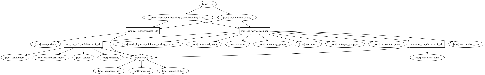

# terraform-aws-ecs
IaC for AWS Elastic Container Service

The full steps can be a little complicated, since it requires the orchestration for the creation of different resources. Also, the following needs to be done:

- Creation of ECR for hosting private repository
- Creation of log group
- Creation of task definition
- Creation of cluster

## Create AWS CloudWatch Log Group 

```bash
$ aws logs create-log-group --log-group-name <NAME> --profile <PROFILE> --region ap-southeast-1
```


## Import ECR Repository

```bash
$ terraform import aws_ecr_repository.service test-service
```


### Errors
```
service idp was unable to place a task because no container instance met all of its requirements. Reason: No Container Instances were found in your cluster. For more information, see the Troubleshooting section.
```

Solution:

1. Go to EC2 Dashboard, and click the Launch Instance button
2. Under Community AMIs, Search for `ecs-optimized`, and select the one that best fits your project needs. Any will work. Click next.

3. When you get to Configure Instance Details, click on the create new IAM role link and create a new role called ecsInstanceRole.

4. Attach the AmazonEC2ContainerServiceforEC2Role policy to that role.

https://docs.aws.amazon.com/AmazonECS/latest/developerguide/ecs-optimized_AMI.html

