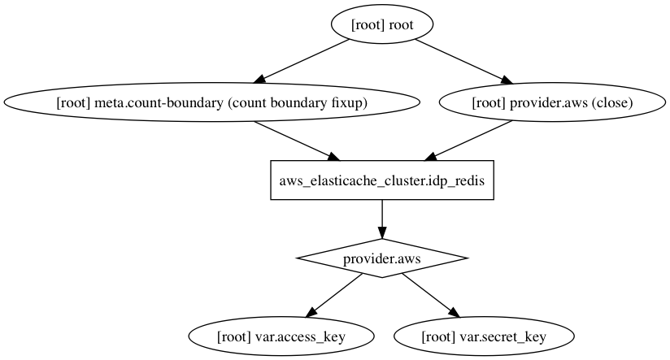

# Terraform Elasticache

## Installation (MacOS)

```bash
$ brew install terraform
```

## Version

```bash
$ terraform --version
```

Output:

```
Terraform v0.11.3
```

## Init

```bash
$ terraform init
```

## Apply

```bash
$ terraform apply -var-file="redis.tfvars"
```

Output:

```
An execution plan has been generated and is shown below.
Resource actions are indicated with the following symbols:
  + create

Terraform will perform the following actions:

  + aws_elasticache_cluster.test_redis
      id:                     <computed>
      apply_immediately:      <computed>
      availability_zone:      "ap-southeast-1a"
      az_mode:                <computed>
      cache_nodes.#:          <computed>
      cluster_address:        <computed>
      cluster_id:             "testredisid"
      configuration_endpoint: <computed>
      engine:                 "Redis"
      engine_version:         "3.2.4"
      maintenance_window:     <computed>
      node_type:              "cache.t2.micro"
      num_cache_nodes:        "1"
      parameter_group_name:   "default.redis3.2"
      port:                   "6379"
      replication_group_id:   <computed>
      security_group_ids.#:   <computed>
      security_group_names.#: <computed>
      snapshot_window:        <computed>
      subnet_group_name:      "default"
      tags.%:                 "1"
      tags.Application:       "app"


Plan: 1 to add, 0 to change, 0 to destroy.

Do you want to perform these actions?
  Terraform will perform the actions described above.
  Only 'yes' will be accepted to approve.

  Enter a value: yes

aws_elasticache_cluster.test_redis: Creating...
  apply_immediately:      "" => "<computed>"
  availability_zone:      "" => "ap-southeast-1a"
  az_mode:                "" => "<computed>"
  cache_nodes.#:          "" => "<computed>"
  cluster_address:        "" => "<computed>"
  cluster_id:             "" => "testredisid"
  configuration_endpoint: "" => "<computed>"
  engine:                 "" => "Redis"
  engine_version:         "" => "3.2.4"
  maintenance_window:     "" => "<computed>"
  node_type:              "" => "cache.t2.micro"
  num_cache_nodes:        "" => "1"
  parameter_group_name:   "" => "default.redis3.2"
  port:                   "" => "6379"
  replication_group_id:   "" => "<computed>"
  security_group_ids.#:   "" => "<computed>"
  security_group_names.#: "" => "<computed>"
  snapshot_window:        "" => "<computed>"
  subnet_group_name:      "" => "default"
  tags.%:                 "" => "1"
  tags.Application:       "" => "Salle"
aws_elasticache_cluster.test_redis: Still creating... (10s elapsed)
aws_elasticache_cluster.test_redis: Still creating... (20s elapsed)
aws_elasticache_cluster.test_redis: Still creating... (30s elapsed)
aws_elasticache_cluster.test_redis: Still creating... (40s elapsed)
aws_elasticache_cluster.test_redis: Still creating... (50s elapsed)
aws_elasticache_cluster.test_redis: Still creating... (1m0s elapsed)
aws_elasticache_cluster.test_redis: Still creating... (1m10s elapsed)
aws_elasticache_cluster.test_redis: Still creating... (1m20s elapsed)
aws_elasticache_cluster.test_redis: Still creating... (1m30s elapsed)
aws_elasticache_cluster.test_redis: Still creating... (1m40s elapsed)
aws_elasticache_cluster.test_redis: Still creating... (1m50s elapsed)
aws_elasticache_cluster.test_redis: Still creating... (2m0s elapsed)
aws_elasticache_cluster.test_redis: Still creating... (2m10s elapsed)
aws_elasticache_cluster.test_redis: Still creating... (2m20s elapsed)
aws_elasticache_cluster.test_redis: Still creating... (2m30s elapsed)
aws_elasticache_cluster.test_redis: Still creating... (2m40s elapsed)
aws_elasticache_cluster.test_redis: Still creating... (2m50s elapsed)
aws_elasticache_cluster.test_redis: Still creating... (3m0s elapsed)
aws_elasticache_cluster.test_redis: Still creating... (3m10s elapsed)
aws_elasticache_cluster.test_redis: Still creating... (3m20s elapsed)
aws_elasticache_cluster.test_redis: Still creating... (3m30s elapsed)
aws_elasticache_cluster.test_redis: Still creating... (3m40s elapsed)
aws_elasticache_cluster.test_redis: Still creating... (3m50s elapsed)
aws_elasticache_cluster.test_redis: Creation complete after 3m55s (ID: testredisid)

Apply complete! Resources: 1 added, 0 changed, 0 destroyed.
```

## Destroying

```bash
$ terraform destroy -var-file=redis.tfvars
```

Output:

```
aws_elasticache_cluster.test_redis: Refreshing state... (ID: testredisid)

An execution plan has been generated and is shown below.
Resource actions are indicated with the following symbols:
  - destroy

Terraform will perform the following actions:

  - aws_elasticache_cluster.test_redis


Plan: 0 to add, 0 to change, 1 to destroy.

Do you really want to destroy?
  Terraform will destroy all your managed infrastructure, as shown above.
  There is no undo. Only 'yes' will be accepted to confirm.

  Enter a value: yes

aws_elasticache_cluster.test_redis: Destroying... (ID: testredisid)
aws_elasticache_cluster.test_redis: Still destroying... (ID: testredisid, 10s elapsed)
aws_elasticache_cluster.test_redis: Still destroying... (ID: testredisid, 20s elapsed)
aws_elasticache_cluster.test_redis: Still destroying... (ID: testredisid, 30s elapsed)
aws_elasticache_cluster.test_redis: Still destroying... (ID: testredisid, 40s elapsed)
aws_elasticache_cluster.test_redis: Still destroying... (ID: testredisid, 50s elapsed)
aws_elasticache_cluster.test_redis: Still destroying... (ID: testredisid, 1m0s elapsed)
aws_elasticache_cluster.test_redis: Still destroying... (ID: testredisid, 1m10s elapsed)
aws_elasticache_cluster.test_redis: Still destroying... (ID: testredisid, 1m20s elapsed)
aws_elasticache_cluster.test_redis: Still destroying... (ID: testredisid, 1m30s elapsed)
aws_elasticache_cluster.test_redis: Still destroying... (ID: testredisid, 1m40s elapsed)
aws_elasticache_cluster.test_redis: Still destroying... (ID: testredisid, 1m50s elapsed)
aws_elasticache_cluster.test_redis: Still destroying... (ID: testredisid, 2m0s elapsed)
aws_elasticache_cluster.test_redis: Still destroying... (ID: testredisid, 2m10s elapsed)
aws_elasticache_cluster.test_redis: Still destroying... (ID: testredisid, 2m20s elapsed)
aws_elasticache_cluster.test_redis: Still destroying... (ID: testredisid, 2m30s elapsed)
aws_elasticache_cluster.test_redis: Still destroying... (ID: testredisid, 2m40s elapsed)
aws_elasticache_cluster.test_redis: Still destroying... (ID: testredisid, 2m50s elapsed)
aws_elasticache_cluster.test_redis: Still destroying... (ID: testredisid, 3m0s elapsed)
aws_elasticache_cluster.test_redis: Still destroying... (ID: testredisid, 3m10s elapsed)
aws_elasticache_cluster.test_redis: Still destroying... (ID: testredisid, 3m20s elapsed)
aws_elasticache_cluster.test_redis: Still destroying... (ID: testredisid, 3m30s elapsed)
aws_elasticache_cluster.test_redis: Still destroying... (ID: testredisid, 3m40s elapsed)
aws_elasticache_cluster.test_redis: Still destroying... (ID: testredisid, 3m50s elapsed)
aws_elasticache_cluster.test_redis: Still destroying... (ID: testredisid, 4m0s elapsed)
aws_elasticache_cluster.test_redis: Still destroying... (ID: testredisid, 4m10s elapsed)
aws_elasticache_cluster.test_redis: Still destroying... (ID: testredisid, 4m20s elapsed)
aws_elasticache_cluster.test_redis: Destruction complete after 4m25s
```

