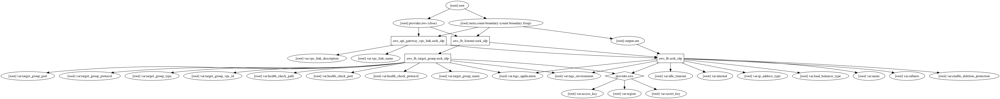

## Init

```bash
$ terraform init
```

## 

## Import

```
$ terraform import aws_lb.bar arn:aws:elasticloadbalancing:us-west-2:123456789012:loadbalancer/app/my-load-balancer/50dc6c495c0c9188
```

## Importing AWS LB Target Group

```bash
$ terraform import aws_lb_target_group.app arn:aws:elasticloadbalancing:us-west-2:187416307283:targetgroup/app-front-end/20cfe21448b66314
```


